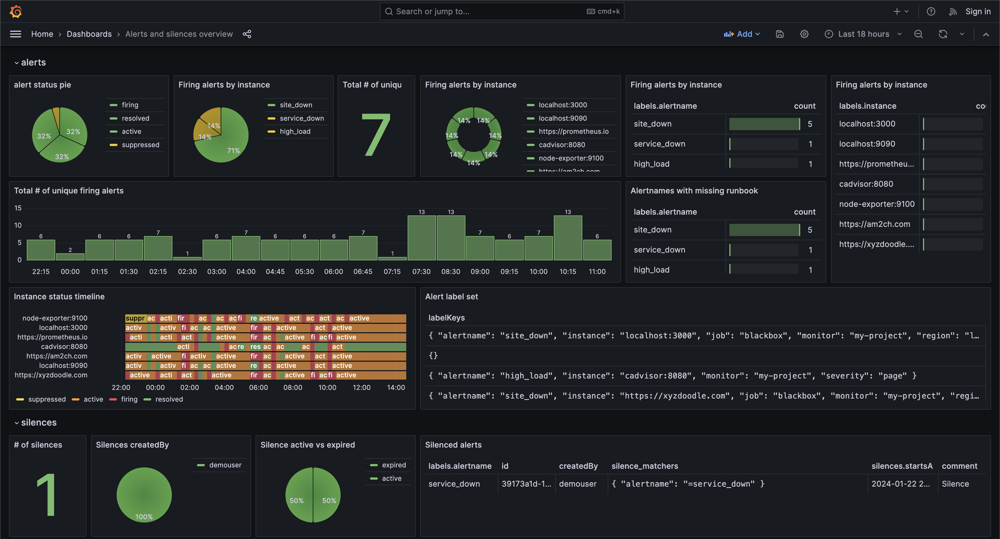

# DIY alerts observability

This demo uses `vector.dev` to collect data from different sources and write the data in the datastore
we use one `http_server` vector instance - to receive Alertmanager webhook notifications,
two `http_client` sources to query Alertmanager's alerts and silence API endpoints and
two `sinks` for writing all the state logs in ClickHouse into `alerts` and `silences` tables.

The docker-compose will bring up several containers:

* `Cadvisor` is used to generate system metrics for monitoring.
* `Prometheus` is used to monitor and generate alerts.
* `Alertmanager` is to route alerts and provide the alert events via webhook and API.
* `alertmanager_silence` is to create an Alertmanager silence.
* `blackbox_exporter` is for monitoring the sites and generating alerts.
* `ClickHouse` is used to write the Alertmanager alert events into the datastore for alerts observability.
* `Vector.dev` - to collect data from Alertmanager webhook, alerts and silences API, transform the data and write into ClickHouse.
* `Grafana` is used to visualize the logs.

## Pre-requisite:
`docker`

## Getting started:

* Setup password for ClickHouse and bring up the containers using docker compose
```console
foo@bar:~$ export CLICKHOUSE_PASSWORD="<PASSWORD here>"
foo@bar:~$ docker compose up
```

Please wait for about 5 minutes for the alerts to be triggered and
visit http://localhost:3000/ to explore the `Alerts and silences overview` dashboard and play around.


